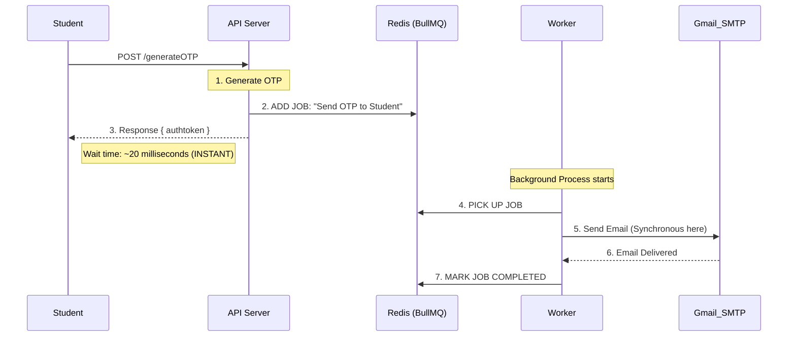

# OTP System Architecture & Scaling Plan

## 🚀 Implemented Architecture: Redis + BullMQ (Option 3)

We have implemented **Option 3**, transforming the OTP system into a production-ready, asynchronous background processing service.

### 1. Asynchronous Flow (Redis + BullMQ)
**Logic:** Decoupled and Non-blocking. The user gets a response instantly.

#### ✅ The Benefits:
- **Instant UX:** The student sees the "Enter OTP" screen almost immediately.
- **Reliability:** If Gmail is down, **BullMQ automatically retries** the job 3 times with an exponential backoff (5s, 10s, 20s).
- **Concurrency:** Your API is free to handle other requests while the Worker does the "heavy lifting."

---

## 🛡️ The Two-Stage Security Flow (JWTs)

To keep the system secure and stateless, we use a two-stage token process:

1.  **Stage 1: The Request Token (Instant):**
    *   **When:** Issued immediately after `/generateOTP`.
    *   **Content:** Contains the user's `email`.
    *   **Purpose:** Acts as a "session badge." It allows the user to access the `/verifyotp` route but nothing else. It ensures that the person verifying the OTP is the same one who requested it.
2.  **Stage 2: The Access Token (Final):**
    *   **When:** Issued only after `/verifyotp` succeeds.
    *   **Content:** Contains full user authorization (e.g., `userId`, `role`).
    *   **Purpose:** The main keycard for the app. Used to book slots, view profiles, etc.

---

## ☁️ Deployment Considerations

When moving from Localhost to Production (e.g., Render, Vercel, Railway):

1.  **Managed Redis:** You cannot use `localhost:6379`. You will need a managed Redis instance.
    *   **Recommendation:** **Upstash** (Serverless Redis, has a great free tier) or **Redis Cloud**.
2.  **Persistence:** Unlike local Redis, Cloud Redis ensures that if your backend restarts, the pending email jobs are not lost.
3.  **Environment Variables:** You must update `REDIS_HOST`, `REDIS_PORT`, and potentially `REDIS_PASSWORD` in your production dashboard.

---

## 🔍 Code Reference (Implemented)

| File | Purpose |
|------|---------|
| `backend/src/config/redis-config.js` | Redis connection setup |
| `backend/src/queues/otpQueue.js` | The "Producer" (adds jobs to Redis) |
| `backend/src/queues/otpWorker.js` | The "Consumer" (processes email sending) |
| `backend/src/routes/v1/otpRoutes.js` | Updated endpoints using the queue |
| `backend/index.js` | Worker initialization on startup |

---

## 📈 Future Scaling (Option 4)

If daily email volume exceeds 2,000 or you need multi-channel notifications (SMS/Push), consider a dedicated microservice.

### Microservice Architecture
- **SendGrid / AWS SES:** Professional email delivery.
- **Twilio:** SMS/WhatsApp fallback.
- **Centralized Templates:** Manage HTML emails outside the main codebase.
